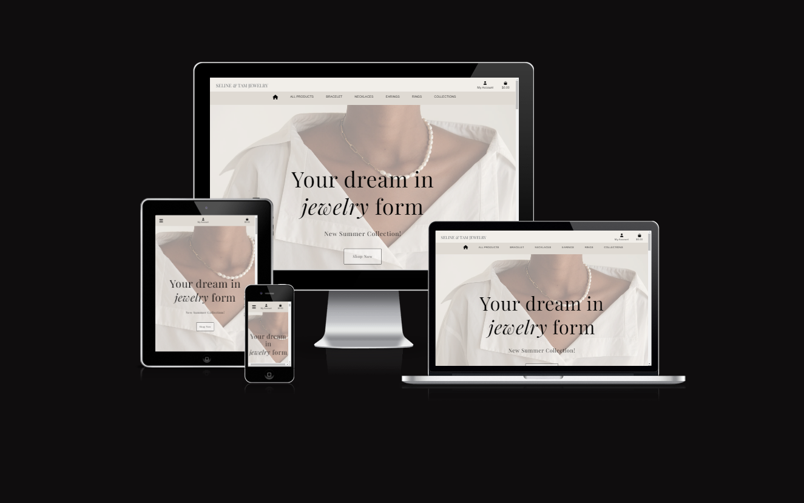

# ***Seline & Tam Jewelry - Portfolio Project 5 Ecommerce***
---
# **1. Key project information**

- **Description :** This Portfolio Project 5 website called **Seline & Tam Jewelry** is a site of imaginary online shop that sells jewelry like bracelets, earings, necklaces and rings. User can easily browse through the shop items, **add/delete** items from their **Wishlist**, express their opinion by leaving a **review** and **comment** on items and most importantly order their selected items for home delivery including online payment.
- **Key project goal :** To offer all visitors of **Seline & Tam Jewelry** site the option to buy their chosen products, select delivery option and finish payment online without the need of leaving the house.
- **Audience :** The audience age of this website is for 18 years and up.
- **Live version :** Live version of **Seline & Tam Jewelry** e-shop page can be viewed [here](https://seline-and-tam-jewelry-ef3ef903eb25.herokuapp.com/).
- **Developer :** [Grozav Sarah Ligia](https://github.com/tomik-z-cech/)

---

# **2. Table of Contents**

---

# **3. Wireframes and Planning**

### Canva wireframes/mockups

I used Canva to make mockups for the website and design how I initially imagined the site would look. 

Desktop Wireframes

### Desktop

**Note!** It should be mentioned at this point that during development, I decided to change a few things in my design.

Also missing here is the contact page. I originally intended this to be in the navbar but now I included a button in Contact section at the bottom of the home page.

#### Home 

#### Clock

#### Collection 

#### Promise

#### Contact

#### Products

#### Product Detail

#### Shopping Bag

#### Checkout

#### Profile

---

### Early Development

At the start of the project, even though I had the wireframes as versions of how I wanted the site to look, I more often than not made early mockup versions of the pages to quickly get the framework of the pages set up and to test whether I might like to do something another way or differently from the wireframes. 

Here is an early example of my index page, mocked up at the very start of the project. 
Key differences here include two more sections about more informations about the jewelry store that I decided to dont include them anymore in my project so that I could focus more on backend. But I want to create them in the future.

I started the project with the home page and nav bar, before installing django allauth and getting the base templates for that. From there, I began working on backend more and didn't focuse on frontend because I wanted to leave it the last, first to make my project work and then add design and fronted details to look better.

Here is an early mockup of my collections page which I decided to don't make it anymore because I did a dropdown button in the navbar from where the user can select easily the collection he wants to see.

---

# **4. User Experience (UX)**

### **4.1.1 The Idea**
- The intention of **Seline & Tam Jewelry** site is to be friendly online shop where users can browse variate of products sorted between categories. Besides that, user can read details of each product, see product reviews and comments.

### **4.1.2 The Ideal User**

The target audience are individuals who are seeking luxury jewelry. Those who want to make gifts or to wear a luxury jewelry for themselves.

- Ideal user likes to shop online
- Ideal user likes to explore new trends and ideas in the jewelry field
- Ideal user likes to share their opinion in form of **reviews** and **comments**

### **4.1.3 Site Goals**

- Offer users ability of shopping online without leaving their home
- Offer users ability of reading other people comments on products
- Offer users ability to add items to their **Wishlist** if they want to save the item for later
- Offer users the ability to see details of each item in shop ( price, description, collection etc. ) 
- Provide site visitors with an easy to navigate site to view jewelry products

### **4.1.4 SEO and Web Marketing**

**Who:** I am marketing predominantly towards a jeweler-enthuasiast.
**What:** I am selling jewelry, designed to cater towards this audience. I therefore make it very accessible and clear on my site, so that the audience can go directly towards what they are looking for. I include images of jewelry, designed to excite the site viewer into wondering what it's like to wear them with some sophisticated clothes. It was equally important to make clear titles and key pieces of information available for the site viewers to see on which ever respective page/product they are viewing.
**How:** Based on my B2C model, I decided single payments with Stripe were the best payment option for the products I'm offering. I can update users on new products and general news through an opt-in mailchimp newsletter subscription and I have created a Facebook page which users/clients can view and follow to keep up to date through a social network.

Software developers play a role in making sure their website can be easily found through search engines, including the reviews of Google Search.
Therefore, when implementing SEO (Search Engine Optimisation) tools, the best means available to you are through descriptive and relevant keywords, sitemaps.xml and robots.txt files.

### **4.1.5 Keywords and sitemap/robots**

- I included keywords and more tags in my base.html document. This allowed me to define keywords, an author, a site description and a viewport. For the keywords themselves I thought about short and longer words and phrases respectively that might be looked for. 

- I started with fairly obvious short words including: jewelry, gold jewelry, gold bracelet, gold necklace,gold rings,gold earings, luxury jewelry.

- I then expanded in to short phrases, including: golden luxury jewelry

- I have included a sitemap.xml file in the root directory, which allows search engines to crawl through my site and make content more discoverable.

- I have a robots.txt file which provides the location of the sitemap and also defines any folders/files which are prohibited from search engine crawlers.

### **4.1.6 Agile Methodologies**

To plan tasks to implement for my website, I used Github Projects, which is a Kanban style board to track your project progress. You can track user stories, epics, ideas, to-do items and you can all see what tasks have been completed.

You can see my project board [here](https://github.com/users/SarahGrozav1/projects/8)

### **4.1.7 User stories**

- [User Story: Products Page]([#1](https://github.com/SarahGrozav1/seline-and-tam-jewelry/issues/1))
    - As a Site User I want to be able to view a list of products so that I can select some to purchase.

- [User Story: Detail Product Page]([#2](https://github.com/SarahGrozav1/seline-and-tam-jewelry/issues/2))
    - As a Site User I want to be able to view individual product details so that I can see the price, description, rating, product image and collection.

- [User Story: Shopping Bag]([#3](https://github.com/SarahGrozav1/seline-and-tam-jewelry/issues/3))
    - As a Site User I want to be able to easily see the total of my purchases at any time so that I can avoiding spending to much.

- [User Story: Register]([#4](https://github.com/SarahGrozav1/seline-and-tam-jewelry/issues/4))
    - As a Site User I want to be able to easily register for an account so that I can have a personal account and be able to view my profile with orders I have made.

- [User Story: Log in/ Log Out page]([#5](https://github.com/SarahGrozav1/seline-and-tam-jewelry/issues/5))
    - As a Site User I want to be able to easily login and logout so that I can access my personal account information.

- [User Story: Success message]([#6](https://github.com/SarahGrozav1/seline-and-tam-jewelry/issues/6))
    - As a  User I want to receive an email confirmation after registering so that I can verify that my account registration was successful.

- [User Story: Profile Page]([#7](https://github.com/SarahGrozav1/seline-and-tam-jewelry/issues/7))
    - As a User I want to be able to have a perosnalized user profile so that I can view my personal order history and order confirmations and save my payment information.

- [User Story: Navbar]([#8](https://github.com/SarahGrozav1/seline-and-tam-jewelry/issues/8))
    - As a Site User I want to be able to sort the list of available products so that I can easily identify the best rated, best prices and sorted products.

- [User Story: Navbar collections dropdown button]([#9](https://github.com/SarahGrozav1/seline-and-tam-jewelry/issues/9))
    - As a Site User I want to be able to see every product from witch collection it is so that I can find it easier.

- [User Story: Product Management Page]([#10](https://github.com/SarahGrozav1/seline-and-tam-jewelry/issues/10))
    - As a Store Owner I want to be able to add a product so that I can add new items to my store

- [User Story: Edit product button]([#11](https://github.com/SarahGrozav1/seline-and-tam-jewelry/issues/11))
    - As a Store Owner I want to be able to Edit a product so that I can change product prices, descriptions, images and other product criteria

- [User Story: Delete product button]([#12](https://github.com/SarahGrozav1/seline-and-tam-jewelry/issues/12))
    - As a Store Owner I want to be able to Delete a product so that I can remove items that are no longer for sale.

- [User Story: Contact Page]([#13](https://github.com/SarahGrozav1/seline-and-tam-jewelry/issues/13))
    - As a Site User I want to be able to contact the store owner so that I can ask if I have questions.

- [User Story: Product Reviews]([#14](https://github.com/SarahGrozav1/seline-and-tam-jewelry/issues/14))
    - As a User I want to be able to see others reviews so that I can decide if I want to purchase that product

- [User Story: Edit review button]([#15](https://github.com/SarahGrozav1/seline-and-tam-jewelry/issues/15))
    - As a User I want to be able to edit my reviews so that I can update them when I want or when I made a mistake.

- [User Story: Delete review button]([#16](https://github.com/SarahGrozav1/seline-and-tam-jewelry/issues/16))
    - As a Site User I want to be able to have a button for delete so that I can delete my review

- [User Story: Error message]([#17](https://github.com/SarahGrozav1/seline-and-tam-jewelry/issues/17))
    - As a Site User I want to be receive error messages so that I know what I did wrong

- [User Story: Google Map]([#18](https://github.com/SarahGrozav1/seline-and-tam-jewelry/issues/18))
    - As a Site User I want to see a Google Map so that I can find the store easier

- [User Story: Wishlist Page]([#19](https://github.com/SarahGrozav1/seline-and-tam-jewelry/issues/19))
    - As a Site User I want to have a wishlist page so that I can see my favourite products

- [User Story: Add to wishlist button]([#20](https://github.com/SarahGrozav1/seline-and-tam-jewelry/issues/20))
    - As a Site User I want to see an 'add to wishlist' button so that I can add my favourite product to wishlist page.

- [User Story: Remove button from wishlist Page]([#21](https://github.com/SarahGrozav1/seline-and-tam-jewelry/issues/21))
    - As a Site User I want to have a 'remove' button for every product adde in wishlist so that I can remove it when I dont want it to be there anymore.

- [User Story: Admin Panel messages]([#22](https://github.com/SarahGrozav1/seline-and-tam-jewelry/issues/22))
    - As a Store Owner I want to be able to see mesages from users so that I know their concern about the website

### **4.1.8 Epics**

- Epic: Install Django
    - As a Developer I would like to install Django so that I can begin working on my project.
    
- Epic: Initial Deploy to Heroku
    - As a Developer I would like to deploy to heroku early so that I can confirm my configuration is wired up correctly.

- Epic: AWS
    - As a Developer I would like to create an AWS S3 bucket so that I can store my static files and media.

- Epic: Login/Logout
    - As a Site User I would like to Login and Logout so that I can keep my account secure.
- Epic: Basket
    - As a Site User I would like to View a Basket so that I can check my orders before checking out.
- Epic: Stripe Checkout
    - As a Site User I would like to checkout so that I can purchase the items I came to buy.
- Epic: Mailchimp Newsletter
    - As a Site User I would like to Sign up to a mailing list so that I can get new information from the business, including new products or promotions.
- Epic: Testing
    - As a Software Developer I would like to Create Manual tests so that I can check the quality and functionality of my code.

---

# **5. Features**

Below is a comprehensive list of the site features and their relations to the user stories:

1. A Nav Bar/Header that:
    - is split in two with a top nav where the user can find company logo that redirects to the   home page when clicked on, account icon when it is clicked on the user can find register or log in functionalities and if it logged the user will see my profile, wishlist and logout functionalities and the last is the basket icon
    - has a middle nav which serves as the main navigation of the site where the user can find a house icon and see products by category by rating , by price or by collections

 - Acceptance Criteria:
        - A Responsive fixed-top header that contains a logo, user icon and basket icon on desktop and a triple line menu icon user icon basket icon and a basket icon on mobile/tablet
        - Nav bar is clean and consistent with the theme and overall design scheme

    

2. A Home Page that:
    - Contains more sections
    - Contains a background image
    - Contains a title and subtitle and a button
    - serves as the entry page 

    

    - Acceptance Criteria:
        - Home Page features a Nav Bar, Main body with Hero image
        - Has a consistent theme and colour scheme
        - Most Pages can be navigated to directly from this one point
        - Theme of site and target audience easily identifiable from the home page alone

  - About Section:

      - Contains three cards with images and text
      - Contains a background with shape divider

    

    - Acceptance Criteria:
        - About section features three cards with details about the company jewelry
        - Has a consistent theme and colour scheme

  - Countdown Section:

      - Contains a background image
      - Contains a header 
      - Contains a digital clock made with js
    
    

    - Acceptance Criteria:

      - Countdown Section features a text header with the date of upcoming collection
      - Has a real countdown clock until the date of upcoming new collection
      - Has a consistent theme and colour scheme

  - New/Last Collection Section:

      - Contains a header with the name of the new collection
      - Contains a paragraph with key words
      - Contains three cards with images
      - Contains name and price of the products showed in the image above
      - Contains a see more button
    
    

    - Acceptance Criteria:

      - Countdown Section features a text header with the date of upcoming collection
      - Has a real countdown clock until the date of upcoming new collection
      - Has a see more button for the user to see more products of that new collection
      - Has a consistent theme and colour scheme

  - Our Promise Section:

      - Contains a header with the title of the section
      - Contains a shape divider for the top of the section
      - Contains four icons 
      - Contains text for each icon
    
    

    - Acceptance Criteria:

      - Have four icons for more informations 
      - Have a text under each icon for the user to understand the icons for more informations
      - Has a consistent theme and colour scheme
      
  - Contact Section:

      - Contains a shape divider for the top of the section
      - Contains a background image only on the half of screen
      - Contains the names of the website managers
      - Contains a button
      - Contains location , email address and phone number
    
    

    - Acceptance Criteria:

      - Have a "Send a message" button for users to contact the seller 
      - Have contact information for users to find them easily
      - Has a consistent theme and colour scheme

  - Map Section:

      - Contains a API Map
    
    

    - Acceptance Criteria:

      - Have a map for users so that they can find easily the store

  - Footer:

      - Contains a hr to separate the page from footer
      - Contains five social media icons
      - Contains a copyright text
    
    

    - Acceptance Criteria:

      - Have social media links inclusive business facebook page for users to find more informations about store and products such as new collections, reviews and owners story.

3. A Contact Page that:
    - Contains navbar
    - Contains a contact form
    - Contains a button
    - Contains a paragraph 
    - Contains footer

    

    - Acceptance Criteria:
        - Contact Page features a navbar so that the user can easily navigate trough the pages
        - Has a consistent theme and colour scheme
        - Have a form so that the user can send easily a message to store owners
        - Have a submit button so that the user can submit the form
        - Have a paragraph with facebook link to invite the users to join the bussiness facebook page

4. A Products Page that:
    - Contains navbar
    - Contains a heading
    - Contains a paragraph
    - Contains all products
    - Contains footer 

    

    - Acceptance Criteria:
        - Products Page features a navbar so that the user can easily navigate trough the pages
        - Has a consistent theme and colour scheme
        - Have a title so that the user know on what page is and in what category
        - Have all products so that the user can see them and buy if wants
        - Have a paragraph where it writes how many products are in the category

  - If user wants to see products from one collection or by category:

      - Contains a different heading for each collection or category
    
    
    

    - Acceptance Criteria:

      - Heading changes on every collection or category so that it would be easier for the user to know in what category or collections he is 

5. A Detail Product Page that:
    - Contains navbar
    - Contains image of the product
    - Contains informations about product
    - Contains quantity field
    - Contains add to bag button
    - Contains wishlist button
    - Contains keep shopping button
    - Contains review section
    - Contains footer 

    

    - Acceptance Criteria:
        -Detail Product Page features a navbar so that the user can easily navigate trough the pages
        - Has a consistent theme and colour scheme
        - Have an image to see how the product look
        - Have informations about product so that the user can read and know more about product
        - Have a wishlist button so that the user can add to the wishlist the product if he wants
        - Have a keep shopping button so that the user can return to all products if he want to see more
        - Have a add to bag button so that the user can add to bag the product if he wants to buy
        - Have a review section where user cand add a review and see others reviews

6. A Bag Page that:
    - Contains navbar
    - Contains a heading
    - Contains image of the product
    - Contains informations about product
    - Contains quantity field
    - Contains total of the bag
    - Contains button to go to checkout
    - Contains keep shopping button
    - Contains footer 

    

    - Acceptance Criteria:
        - Shopping Bag Page features a navbar so that the user can easily navigate trough the pages
        - Has a consistent theme and colour scheme
        - Have an image to see how the product look
        - Have informations about product so that the user know the name and price of the product
        - Have a quantity field so that the user can add or delete the quantity of the product
        - Have a grand total so that the user can see how much it will cost all the products in total
        - Have a checkout button so that the user can go for the next step to finish the order
        - Have a keep shopping button so that the user can return to all products if he want to see more

7. A Checkout Page that:
    - Contains navbar
    - Contains a heading
    - Contains a form 
    - Contains image of the product
    - Contains informations about product
    - Contains total of the bag
    - Contains complete order button 
    - Contains adjust bag button
    - Contains footer 

    

    - Acceptance Criteria:
        -Checkout Bag Page features a navbar so that the user can easily navigate trough the pages
        - Has a consistent theme and colour scheme
        - Have an image to see how the product look
        - Have informations about product so that the user know the name and price of the product
        - Have a grand total so that the user can see how much it will cost all the products in total
        - Have a complete order button so that the user can finish the order
        - Have a adjust bag button so that the user can return to bag page if he want to change something in his order

8. A Success checkout Page that:
    - Contains navbar
    - Contains a heading
    - Contains informations about order
    - Contains keep shopping button
    - Contains footer 

    

    - Acceptance Criteria:
        - Success Checkout Page features a navbar so that the user can easily navigate trough the pages
        - Has a consistent theme and colour scheme
        - Have informations about the order so that the user know informations about his order
        - Have a keep shopping button so that the user can return to all products if he want to see more

9. A Profile Page that:
    - Contains navbar
    - Contains a heading
    - Contains a form for users address
    - Contains button for updating informations
    - Contains saved orders of the user
    - Contains footer 

    

    - Acceptance Criteria:
        - Profile Page features a navbar so that the user can easily navigate trough the pages
        - Has a consistent theme and colour scheme
        - Have informations about users address
        - Have a button for updating informations so that the user can update his address informations
        - Have all his orders saved with details so that the user know everything about his old orders

10. A Wishlist Page that:
    - Contains navbar
    - Contains a heading
    - Contains a paragraph
    - Contains all products added to wishlist
    - Contains footer 

    

    - Acceptance Criteria:
        - Shopping Bag Page features a navbar so that the user can easily navigate trough the pages
        - Has a consistent theme and colour scheme
        - Have a title so that the user know on what page is
        - Have all saved products so that the user can see them and buy if wants
        - Have a paragraph where it writes how many products are in the wishlist

11. An Admin-only management page that:
    - is accessed through a superuser exclusive link
    - opens a page for admins to add new products

    

    - Acceptance Criteria:
        - Superuser/Admin only access
        - Products can be added to the database from a form on the page

12. A custom error 404 page that:
    - will appear if the user looks for a page that doesn't exist
    - will encourage the user to return to the home page through a home page button clearly displayed

    
 

    